# WEB SOLUTION WITH WORDPRESS

In this project we are tasked to prepare storage infrastructure on two Linux servers and implement a basic web solution using WordPress. WordPress is a free and open-source content management system written in PHP and paired with MySQL or MariaDB as its backend Relational Database Management System (RDBMS).

This project consists of two parts:

- Configure storage subsystem for Web and Database servers based on Linux OS. The focus of this part is to give you practical experience of working with disks, partitions and volumes in Linux.

- Install WordPress and connect it to a remote MySQL database server. This part of the project will solidify your skills of deploying Web and DB tiers of Web solution.

As a DevOps engineer, a deep understanding of core components of web solutions and the ability to troubleshoot them will play essential role in your further progress and development.

## Three-tier Architecture
Generally, web, or mobile solutions are implemented based on what is called the Three-tier Architecture.

Three-tier Architecture is a client-server software architecture pattern that comprise of 3 separate layers. They are:
- <b>Presentation Layer (PL)</b>: This is the user interface such as the client server or browser on your laptop.
- <b>Business Layer (BL)</b>: This is the backend program that implements business logic. Application or Webserver
- <b>Data Access or Management Layer (DAL)</b>: This is the layer for computer data storage and data access. Database Server or File System Server such as FTP server, or NFS Server.

With this project, you will have the hands-on experience that showcases Three-tier Architecture while also ensuring that the disks used to store files on the Linux servers are adequately partitioned and managed through programs such as gdisk and LVM respectively.

Requirements:
1. <b>Your 3-Tier Setup</b>
    - A Laptop or PC to serve as a client
    - An EC2 Linux Server as a web server (This is where you will install WordPress)
    - An EC2 Linux server as a database (DB) server

<b>Note:</b> We are using RedHat OS for this project, you should be able to spin up an EC2 instance on your own. Also when connecting to RedHat you will need to use ec2-user user. Connection string will look like ec2-user@public-ip-address.


## Creating and mounting Volumes
- Create and attach a new volume to your Linux server.

    Results:
    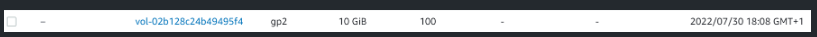
    Note: Ensure that the availability zone of your volume must be the same as your Linux server.

- Connect to your linux server and check if the volume is attached using this command:
    ```
    lsblk
    ```
    Results:
    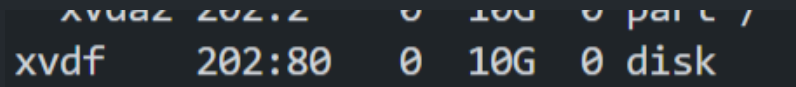

<!-- - We need to check whether the new volume has a filesystem or not, if it doesn't have one we will need to create one.
    ```
    sudo file -s /dev/xvdf
    ```
    Results:
    
    From the above output, we can see that there's no filesystem present on the volume.

- To create a filesystem we need to run the command below:
    ```
    sudo mkfs -t ext4 /dev/xvdf
    ```
    Results:
    

- Now that we've created a filesystem on the volume we would be required to create a folder that we would point to the volume.
    ```
    sudo mkdir /newVolume && sudo mount /dev/xvdf /newVolume
    ```
    then we need to check if the folder has been pointed to the new drive/volume.
    ```
    df -hT
    ```
    Results:
    

- To have the folder pointing permanently to the drive we need open the /etc/fstab and add the following code:
    ```
    nano /etc/fstab
    ```
    and add this
    ```
    /dev/xvdf /newVolume ext4 defaults,nofail, 0 0
    ```
    Results:
    

- To check whether everything is running fine run the command below:
    ```
    sudo mount -a
    ```
    Results:
     -->

- Use df -h command to see all mounts and free space on your server
    ```
    sudo df -h
    ```
    Results:
    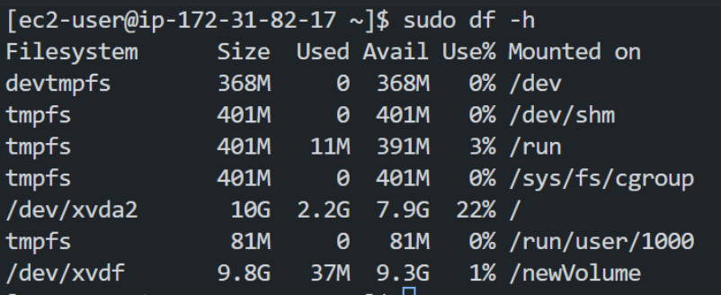

- Use gdisk utility to create a single partition on each of the 3 disks
    ```
    sudo gdisk /dev/xvdf
    ```
    and then use the w command and enter "y" to create a single partition.

    Also repeat the same for the other two disks
    ```
    sudo gdisk /dev/xvdg
    sudo gdisk /dev/xvdh
    ```
    Results:
    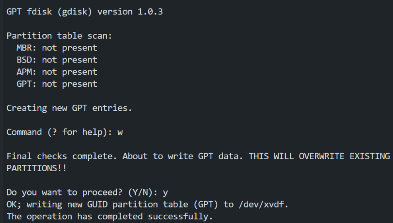

- Use lsblk utility to view the newly configured partition on each of the 3 disks.
    ```
    sudo lsblk
    ```
    Results:
    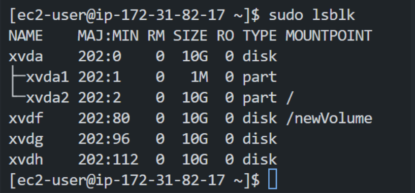

- Install lvm2 package using sudo yum install lvm2. Run sudo lvmdiskscan command to check for available partitions.
    ```
    sudo yum install lvm2
    sudo lvmdiskscan
    ```
    Results:
    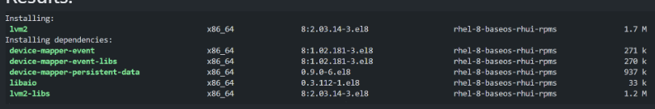
    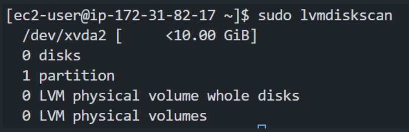
    Note: Unlike ubuntu that uses apt, for redhat the package manager is yum.

- Use pvcreate utility to mark each of 3 disks as physical volumes (PVs) to be used by LVM
    ```
    sudo pvcreate /dev/xvdf
    sudo pvcreate /dev/xvdg
    sudo pvcreate /dev/xvdh
    ```
    Results:
    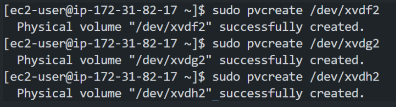

- Verify that your Physical volume has been created successfully by running sudo pvs
    ```
    sudo pvs
    ```
    Results:
    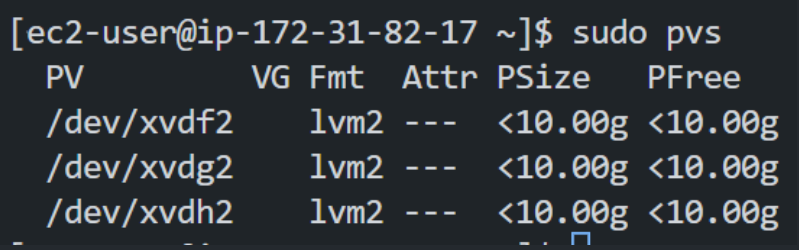

- Use vgcreate utility to add all 3 PVs to a volume group (VG). Name the VG webdata-vg
    ```
    sudo vgcreate webdata-vg /dev/xvdf2 /dev/xvdg2 /dev/xvdh2
    ```
    Results:
    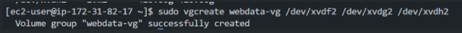

- Use lvcreate utility to create 2 logical volumes. apps-lv (Use half of the PV size), and logs-lv Use the remaining space of the PV size. NOTE: apps-lv will be used to store data for the Website while, logs-lv will be used to store data for logs.
    ```
    sudo lvcreate -n apps-lv -L 14G webdata-vg
    sudo lvcreate -n logs-lv -L 14G webdata-vg
    ```
    Results:
    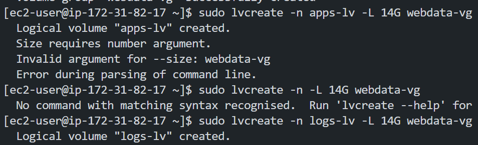

- Verify that your Logical Volume has been created successfully by running sudo lvs
    ```
    sudo lvs
    ```
    Results:
    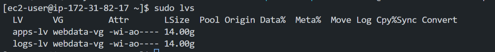

- Verify the entire setup
    ```
    sudo vgdisplay -v #view complete setup - VG, PV, and LV
    sudo lsblk 
    ```
    Results:
    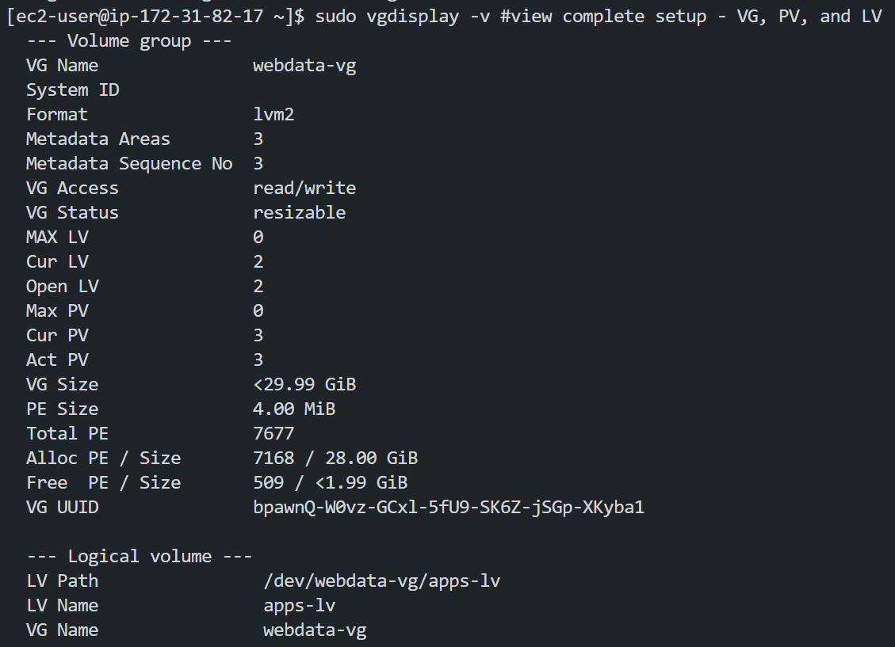
    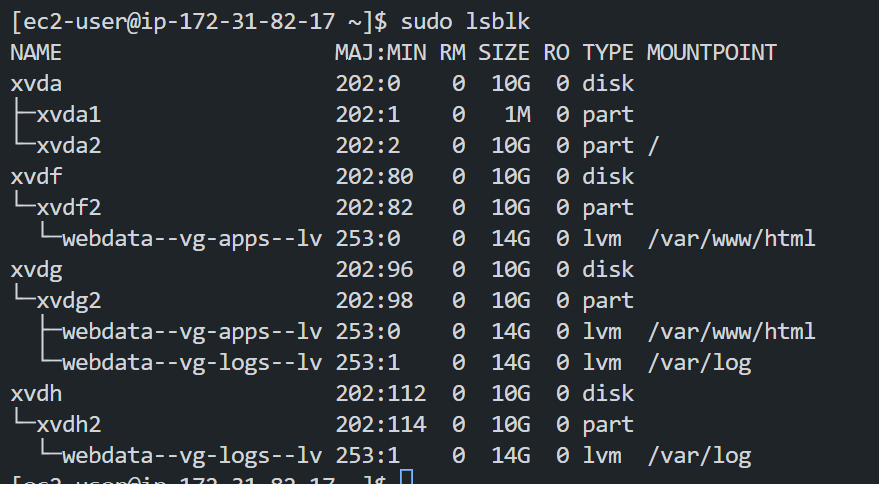

- Use mkfs.ext4 to format the logical volumes with ext4 filesystem
    ```
    sudo mkfs.ext4 /dev/webdata-vg/apps-lv
    sudo mkfs.ext4 /dev/webdata-vg/logs-lv
    ```
    Results:
    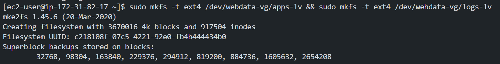

## Creating a directory structure.
- Create /var/www/html directory to store website files
    ```
    sudo mkdir -p /var/www/html
    ```
    Results:
    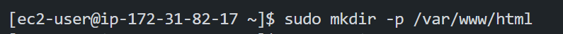

- Create /home/recovery/logs to store backup of log data
    ```
    sudo mkdir -p /home/recovery/logs
    ```
    Results:
    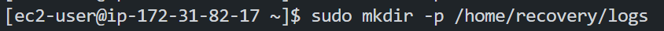

- Mount /var/www/html on apps-lv logical volume
    ```
    sudo mount /dev/webdata-vg/apps-lv /var/www/html/
    ```
    Results:
    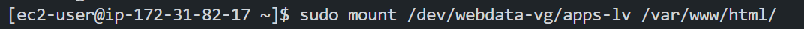

- Use rsync utility to backup all the files in the log directory /var/log into /home/recovery/logs (This is required before mounting the file system)
    ```
    sudo rsync -av /var/log/. /home/recovery/logs/
    ```
    Results:
    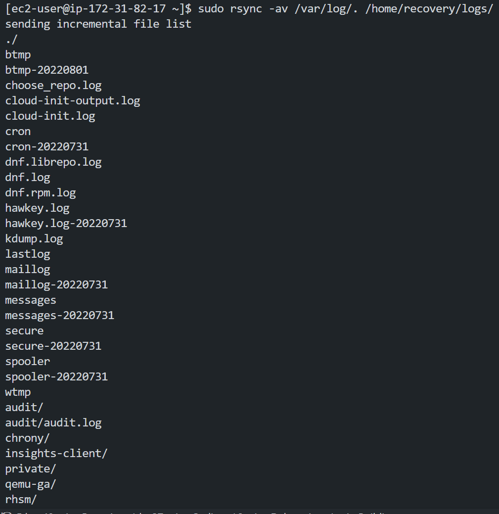

- Mount /var/log on logs-lv logical volume. (Note that all the existing data on /var/log will be deleted. That is why step of creating /var/www/html directory to store website files)
    ```
    sudo mount /dev/webdata-vg/logs-lv /var/log
    ```
    Results:
    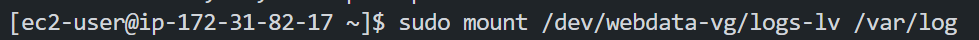

- Restore log files back into /var/log directory
    ```
    sudo rsync -av /home/recovery/logs/. /var/log
    ```
    Results:
    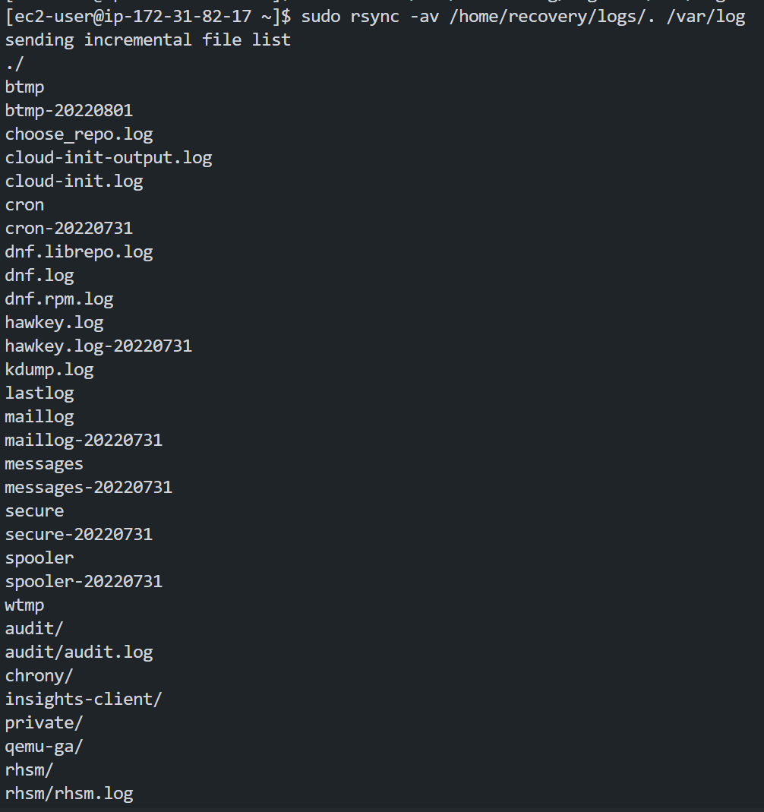


## UPDATING THE `/ETC/FSTAB` FILE
- Update /etc/fstab file so that the mount configuration will persist after restart of the server.
The UUID of the device will be used to update the /etc/fstab file;
    ```
    sudo blkid
    ```
    Results:
    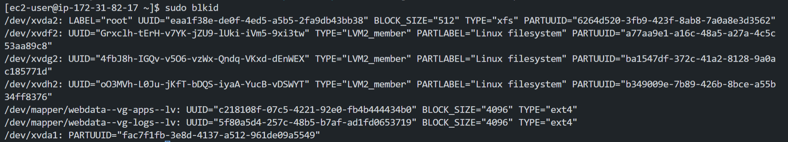

- Update /etc/fstab in this format using your own UUID and rememeber to remove the leading and ending quotes.
    ```
    sudo nano /etc/fstab
    ```
    and add this
    ```
    UUID=<uuid of your webdata-vg-apps> /var/www/html ext4 defaults 0 0
    UUID=<uuid of your webdata-vg-logs> /var/log ext4 defaults 0 0
    ```
    Results:
    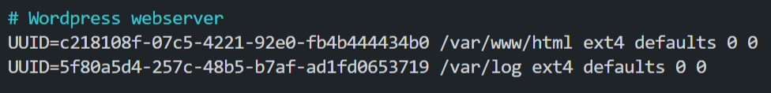

- Test the configuration and reload the daemon
    ```
    sudo mount -a
    sudo systemctl daemon-reload
    ```
    Results:
    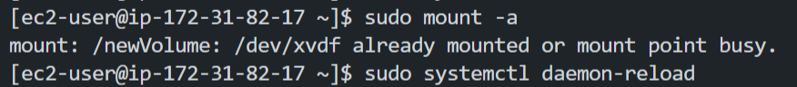

- Verify your setup by running df -h, output must look like this:
    ```
    sudo df -h
    ```
    Results:
    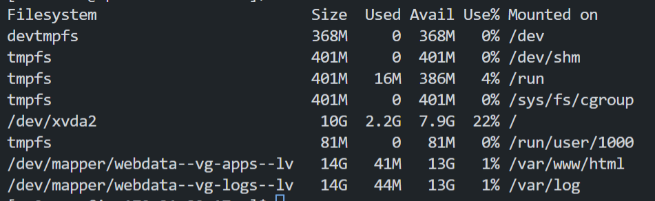


## Prepare the Database Server
Launch a second RedHat EC2 instance that will have a role – ‘DB Server’
Repeat the same steps as for the Web Server, but instead of apps-lv create db-lv and mount it to /db directory instead of /var/www/html/.

- ssh into the instance you just created
    ```
    ssh -i <your_key_file> ec2-user@<public_ip_address>
    ```
    Results:
    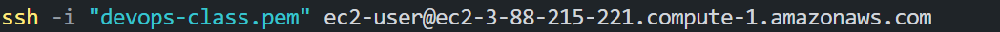