# WEB SOLUTION WITH WORDPRESS

In this project we are tasked to prepare storage infrastructure on two Linux servers and implement a basic web solution using WordPress. WordPress is a free and open-source content management system written in PHP and paired with MySQL or MariaDB as its backend Relational Database Management System (RDBMS). 

This project consists of two parts:

- Configure storage subsystem for Web and Database servers based on Linux OS. The focus of this part is to give you practical experience of working with disks, partitions and volumes in Linux.

- Install WordPress and connect it to a remote MySQL database server. This part of the project will solidify your skills of deploying Web and DB tiers of Web solution.

As a DevOps engineer, a deep understanding of core components of web solutions and the ability to troubleshoot them will play essential role in your further progress and development.

## Three-tier Architecture
Generally, web, or mobile solutions are implemented based on what is called the Three-tier Architecture.

Three-tier Architecture is a client-server software architecture pattern that comprise of 3 separate layers. They are:
- <b>Presentation Layer (PL)</b>: This is the user interface such as the client server or browser on your laptop.
- <b>Business Layer (BL)</b>: This is the backend program that implements business logic. Application or Webserver
- <b>Data Access or Management Layer (DAL)</b>: This is the layer for computer data storage and data access. Database Server or File System Server such as FTP server, or NFS Server.

With this project, you will have the hands-on experience that showcases Three-tier Architecture while also ensuring that the disks used to store files on the Linux servers are adequately partitioned and managed through programs such as gdisk and LVM respectively.

Requirements:
1. <b>Your 3-Tier Setup</b>
    - A Laptop or PC to serve as a client
    - An EC2 Linux Server as a web server (This is where you will install WordPress)
    - An EC2 Linux server as a database (DB) server

<b>Note:</b> We are using RedHat OS for this project, you should be able to spin up an EC2 instance on your own. Also when connecting to RedHat you will need to use ec2-user user. Connection string will look like ec2-user@public-ip-address.


## Creating and mounting Volumes
- Create and attach a new volume to your Linux server.

    Results:
    
    Note: Ensure that the availability zone of your volume must be the same as your Linux server.

- Connect to your linux server and check if the volume is attached using this command:
    ```
    lsblk
    ```
    Results:
    


- Use df -h command to see all mounts and free space on your server
    ```
    sudo df -h
    ```
    Results:
    

- Use gdisk utility to create a single partition on each of the 3 disks
    ```
    sudo gdisk /dev/xvdf
    ```
    and then use the w command and enter "y" to create a single partition.

    Also repeat the same for the other two disks
    ```
    sudo gdisk /dev/xvdg
    sudo gdisk /dev/xvdh
    ```
    Results:
    

- Use lsblk utility to view the newly configured partition on each of the 3 disks.
    ```
    sudo lsblk
    ```
    Results:
    

- Install lvm2 package using sudo yum install lvm2. Run sudo lvmdiskscan command to check for available partitions.
    ```
    sudo yum install lvm2
    sudo lvmdiskscan
    ```
    Results:
    
    
    Note: Unlike ubuntu that uses apt, for redhat the package manager is yum.

- Use pvcreate utility to mark each of 3 disks as physical volumes (PVs) to be used by LVM
    ```
    sudo pvcreate /dev/xvdf
    sudo pvcreate /dev/xvdg
    sudo pvcreate /dev/xvdh
    ```
    Results:
    

- Verify that your Physical volume has been created successfully by running sudo pvs
    ```
    sudo pvs
    ```
    Results:
    

- Use vgcreate utility to add all 3 PVs to a volume group (VG). Name the VG webdata-vg
    ```
    sudo vgcreate webdata-vg /dev/xvdf2 /dev/xvdg2 /dev/xvdh2
    ```
    Results:
    

- Use lvcreate utility to create 2 logical volumes. apps-lv (Use half of the PV size), and logs-lv Use the remaining space of the PV size. NOTE: apps-lv will be used to store data for the Website while, logs-lv will be used to store data for logs.
    ```
    sudo lvcreate -n apps-lv -L 14G webdata-vg
    sudo lvcreate -n logs-lv -L 14G webdata-vg
    ```
    Results:
    

- Verify that your Logical Volume has been created successfully by running sudo lvs
    ```
    sudo lvs
    ```
    Results:
    

- Verify the entire setup
    ```
    sudo vgdisplay -v #view complete setup - VG, PV, and LV
    sudo lsblk 
    ```
    Results:
    
    

- Use mkfs.ext4 to format the logical volumes with ext4 filesystem
    ```
    sudo mkfs.ext4 /dev/webdata-vg/apps-lv
    sudo mkfs.ext4 /dev/webdata-vg/logs-lv
    ```
    Results:
    

## Creating a directory structure.
- Create /var/www/html directory to store website files
    ```
    sudo mkdir -p /var/www/html
    ```
    Results:
    

- Create /home/recovery/logs to store backup of log data
    ```
    sudo mkdir -p /home/recovery/logs
    ```
    Results:
    

- Mount /var/www/html on apps-lv logical volume
    ```
    sudo mount /dev/webdata-vg/apps-lv /var/www/html/
    ```
    Results:
    

- Use rsync utility to backup all the files in the log directory /var/log into /home/recovery/logs (This is required before mounting the file system)
    ```
    sudo rsync -av /var/log/. /home/recovery/logs/
    ```
    Results:
    

- Mount /var/log on logs-lv logical volume. (Note that all the existing data on /var/log will be deleted. That is why step of creating /var/www/html directory to store website files)
    ```
    sudo mount /dev/webdata-vg/logs-lv /var/log
    ```
    Results:
    

- Restore log files back into /var/log directory
    ```
    sudo rsync -av /home/recovery/logs/. /var/log
    ```
    Results:
    


## UPDATING THE `/ETC/FSTAB` FILE
- Update /etc/fstab file so that the mount configuration will persist after restart of the server.
The UUID of the device will be used to update the /etc/fstab file;
    ```
    sudo blkid
    ```
    Results:
    

- Update /etc/fstab in this format using your own UUID and rememeber to remove the leading and ending quotes.
    ```
    sudo nano /etc/fstab
    ```
    and add this
    ```
    UUID=<uuid of your webdata-vg-apps> /var/www/html ext4 defaults 0 0
    UUID=<uuid of your webdata-vg-logs> /var/log ext4 defaults 0 0
    ```
    Results:
    

- Test the configuration and reload the daemon
    ```
    sudo mount -a
    sudo systemctl daemon-reload
    ```
    Results:
    

- Verify your setup by running df -h, output must look like this:
    ```
    sudo df -h
    ```
    Results:
    


## Preparing the Database Server
Launch a second RedHat EC2 instance that will have a role – ‘DB Server’
Repeat the same steps as for the Web Server, but instead of apps-lv create db-lv and mount it to /db directory instead of /var/www/html/.

- ssh into the instance you just created
    ```
    ssh -i <your_key_file> ec2-user@<public_ip_address>
    ```
    Results:
    

- Create and attach 3 Logical Volumes to the database server instance.
    

- Connect to your linux server and check if the volume is attached using this command:
    ```
    sudo lsblk
    ```
    Results:
    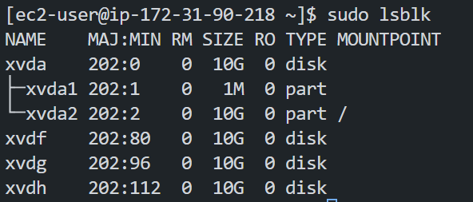

- Use df -h command to see all mounts and free space on your server
    ```
    sudo df -h
    ```
    Results:
    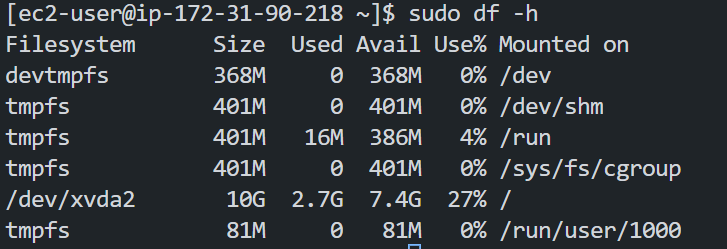

- Using gdisk utility create a single partition on each of the 3 disks
    ```
    sudo gdisk /dev/xvdf
    ```
    and then create a new partition with the "n" command, inputting 1 (to create a single partition) and then the "w" command and enter "y" to create a single partition.

    Also repeat the same for the other two disks
    ```
    sudo gdisk /dev/xvdg
    sudo gdisk /dev/xvdh
    ```
    Results:
    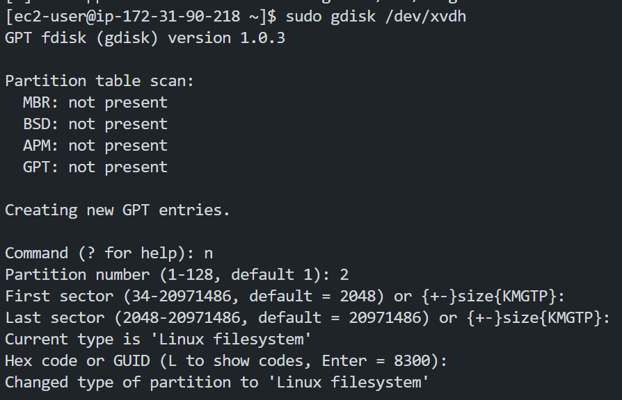

- Use lsblk utility to view the newly configured partition on each of the 3 disks.
    ```
    sudo lsblk
    ```
    Results:
    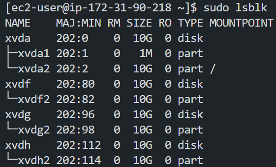

- Install lvm2 package using sudo yum install lvm2. Run sudo lvmdiskscan command to check for available partitions.
    ```
    sudo yum install lvm2
    sudo lvmdiskscan
    ```
    Results:
    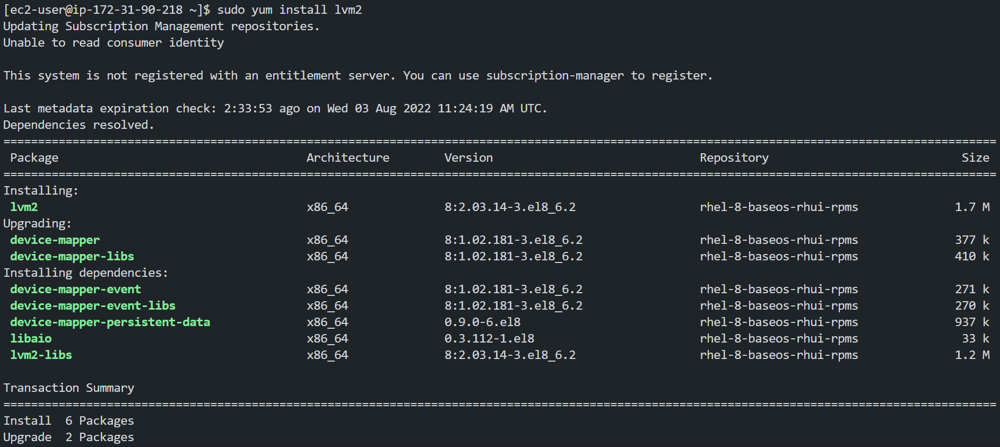
    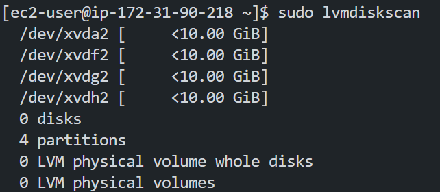
    Note: Unlike ubuntu that uses apt, for redhat the package manager is yum.

- Use pvcreate utility to mark each of 3 disks as physical volumes (PVs) to be used by LVM
    ```
    sudo pvcreate /dev/xvdf2 /dev/xvdg2 /dev/xvdh2
    ```
    Results:
    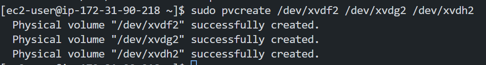

- Verify that your Physical volume has been created successfully by running sudo pvs
    ```
    sudo pvs
    ```
    Results:
    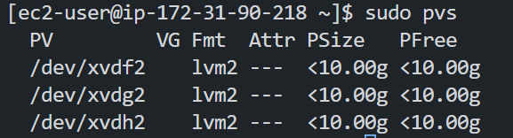

- Use vgcreate utility to add all 3 PVs to a volume group (VG). Name the VG webdata-vg
    ```
    sudo vgcreate dbdata-vg /dev/xvdf2 /dev/xvdg2 /dev/xvdh2
    ```
    Results:
    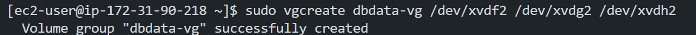

- Use lvcreate utility to create 2 logical volumes. apps-lv (Use half of the PV size), and logs-lv Use the remaining space of the PV size. NOTE: apps-lv will be used to store data for the Website while, logs-lv will be used to store data for logs.
    ```
    sudo lvcreate -n db-lv -L 14G dbdata-vg
    sudo lvcreate -n logs-lv -L 14G dbdata-vg
    ```
    Results:
    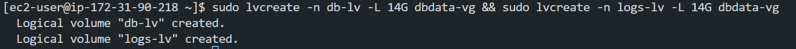

- Verify that your Logical Volume has been created successfully by running sudo lvs
    ```
    sudo lvs
    ```
    Results:
    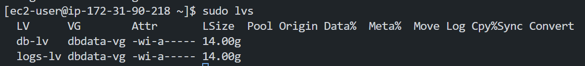

- We need to verify all we have done so far on the database server instance so far with these commands.
    ```
    sudo vgdisplay -v #view complete setup - VG, PV, and LV
    sudo lsblk 
    ```
    Results:
    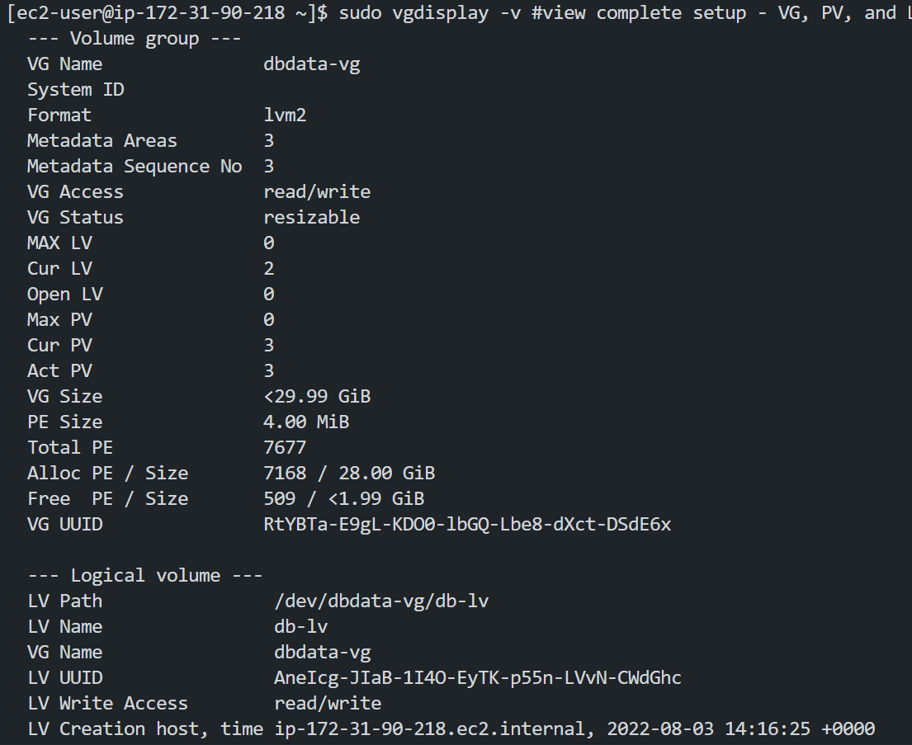
    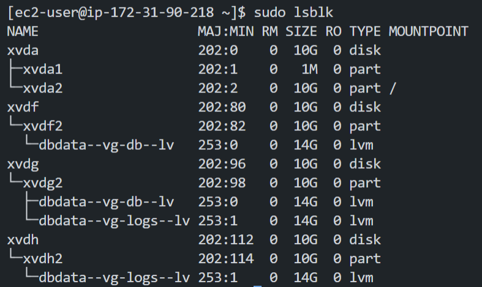

- Use mkfs.ext4 to format the logical volumes with ext4 filesystem
    ```
    sudo mkfs.ext4 /dev/dbdata-vg/db-lv && sudo mkfs.ext4 /dev/dbdata-vg/logs-lv
    ```
    Results:
    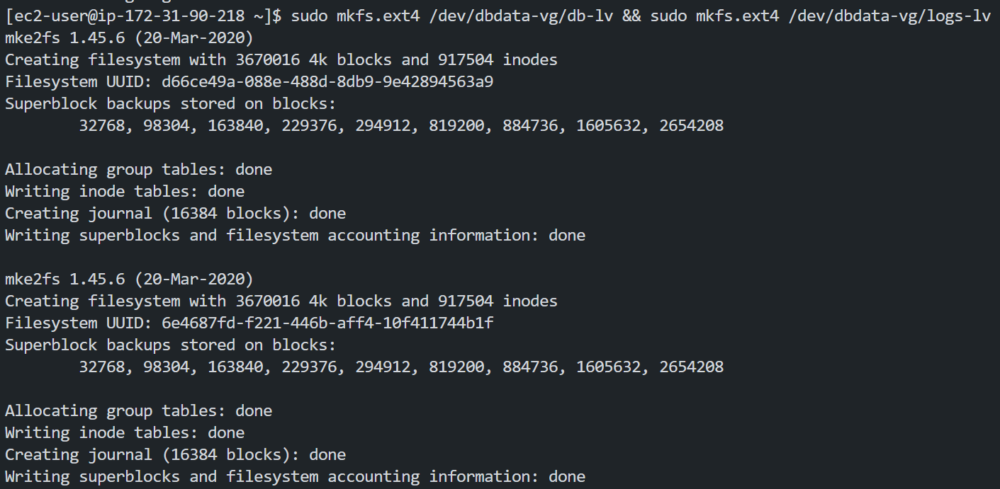

Now that we are done configuring the database logical volumes, we would be moving on with creating the mount points for the logical volumes and the required directories.

- Create /db directory to store website files
    ```
    sudo mkdir -p /db
    ```
    Results:
    

- Create /home/recovery/logs to store backup of log data
    ```
    sudo mkdir -p /home/recovery/logs
    ```
    Results:
    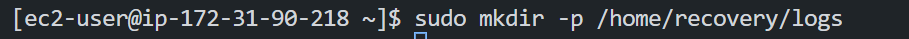

- Mount /db on apps-lv logical volume
    ```
    sudo mount /dev/dbdata-vg/db-lv /db
    ```
    Results:
    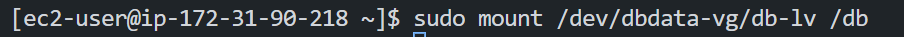

- Like we did for the webserver instance use rsync utility to backup all the files in the log directory /var/log into /home/recovery/logs (This is required before mounting the file system)
    ```
    sudo rsync -av /var/log/. /home/recovery/logs/
    ```
    Results:
    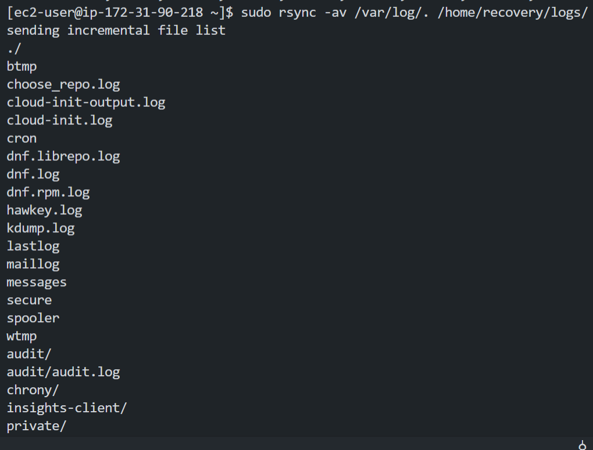

- Mount /var/log on logs-lv logical volume. (Note that all the existing data on /var/log will be deleted. That is why step of creating /db directory to store database files)
    ```
    sudo mount /dev/dbdata-vg/logs-lv /var/log
    ```
    Results:
    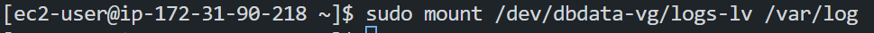

- Restore log files back into /var/log directory
    ```
    sudo rsync -av /home/recovery/logs/. /var/log
    ```
    Results:
    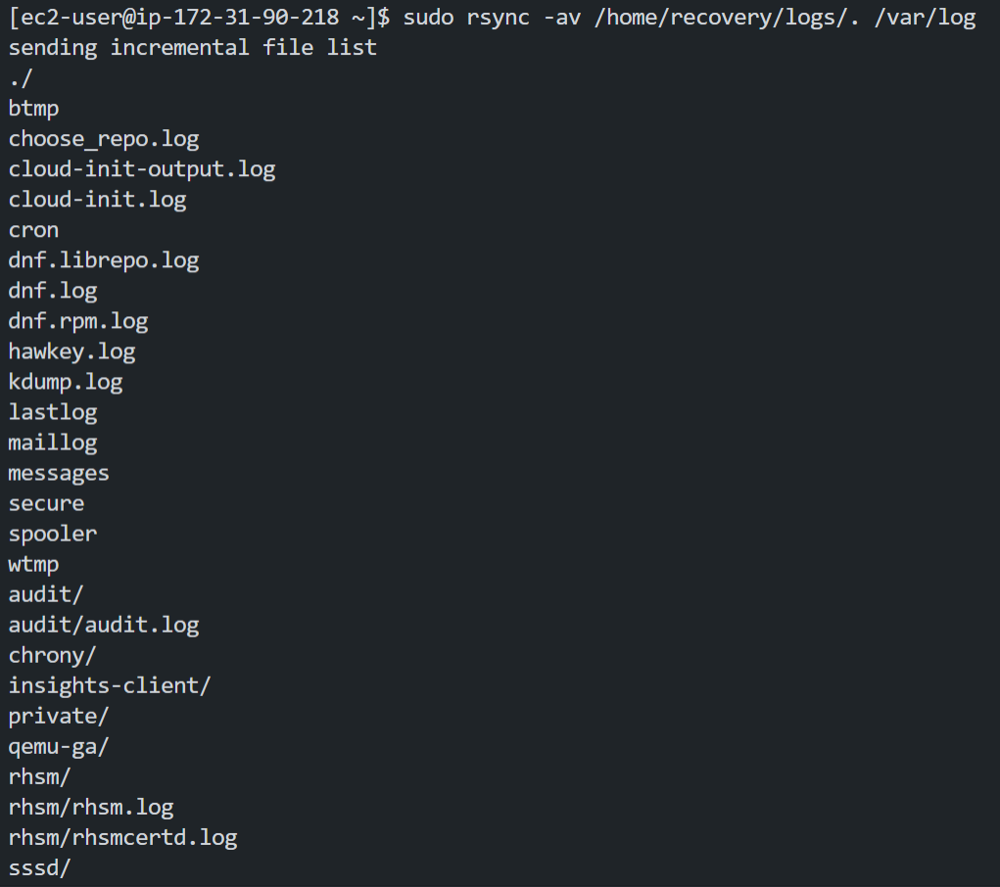

Now we need to update the /etc/fstab file to ensure that the configurations we made is persistent across reboots.

- Update /etc/fstab file so that the mount configuration will persist after restart of the server.
The UUID of the device will be used to update the /etc/fstab file;
    ```
    sudo blkid
    ```
    Results:
    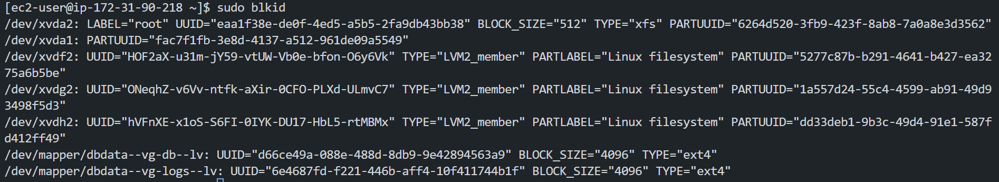

- Update /etc/fstab in this format using your own UUID and rememeber to remove the leading and ending quotes.
    ```
    sudo nano /etc/fstab
    ```
    and add this
    ```
    UUID=<uuid of your webdata-vg-apps> /var/www/html ext4 defaults 0 0
    UUID=<uuid of your webdata-vg-logs> /var/log ext4 defaults 0 0
    ```
    Results:
    

- Test the configuration and reload the daemon
    ```
    sudo mount -a
    sudo systemctl daemon-reload
    ```
    Results:
    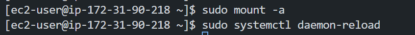

- Verify your setup by running df -h, output must look like this:
    ```
    sudo df -h
    ```
    Results:
    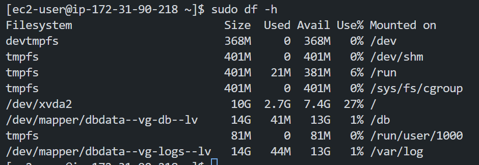

Now your db server is ready to go and make other configurations as required.

## Install WordPress on your Web Server EC2 Instance
- Update the repository
    ```
    sudo yum update
    ```
    Results:
    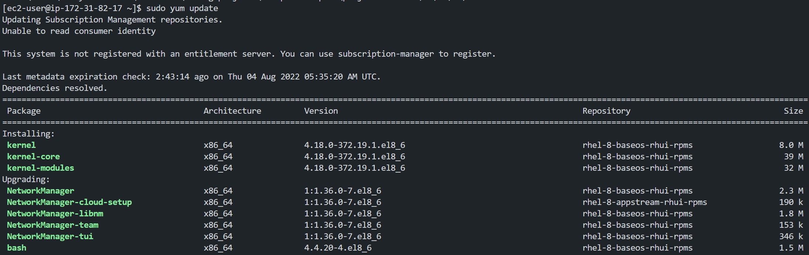

- Install wget, Apache and it’s dependencies
    ```
    sudo yum -y install wget httpd php php-mysqlnd php-fpm php-json
    ```
    Results:
    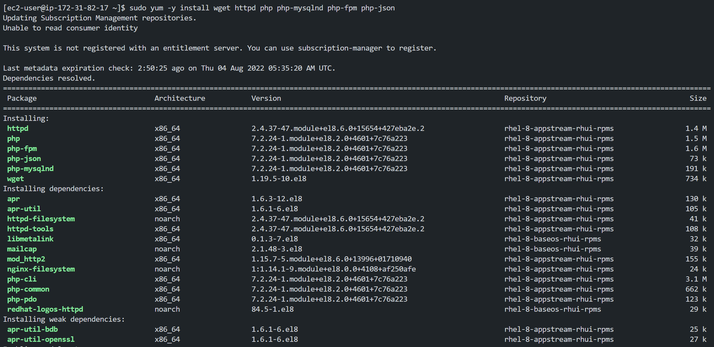

- Start the apache service
    ```
    sudo systemctl enable httpd
    sudo systemctl start httpd
    ```
    Results:
    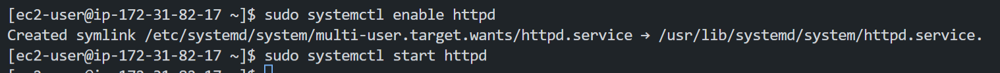

- To install PHP and it’s depemdencies
    ```
    sudo yum install https://dl.fedoraproject.org/pub/epel/epel-release-latest-8.noarch.rpm
    sudo yum install yum-utils http://rpms.remirepo.net/enterprise/remi-release-8.rpm
    sudo yum module list php
    sudo yum module reset php
    sudo yum module enable php:remi-7.4
    sudo yum install php php-opcache php-gd php-curl php-mysqlnd
    sudo systemctl start php-fpm
    sudo systemctl enable php-fpm
    setsebool -P httpd_execmem 1
    ```
    Results:
    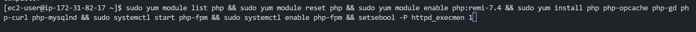

- Restart Apache
    ```
    sudo systemctl restart httpd
    ```
    Results:
    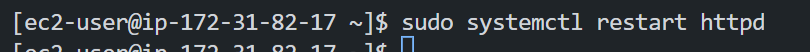

- Download wordpress and copy wordpress to var/www/html
    ```
    mkdir wordpress
    cd   wordpress
    sudo wget http://wordpress.org/latest.tar.gz
    sudo tar xzvf latest.tar.gz
    sudo rm -rf latest.tar.gz
    cp wordpress/wp-config-sample.php wordpress/wp-config.php
    cp -R wordpress /var/www/html/
    ```
    Results:
    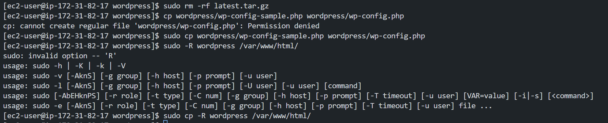

- Configure SELinux Policies
    ```
    sudo chown -R apache:apache /var/www/html/wordpress
    sudo chcon -t httpd_sys_rw_content_t /var/www/html/wordpress -R
    sudo setsebool -P httpd_can_network_connect=1
    ```
    Results:
    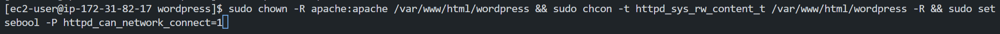

## Install MySQL on your DB Server EC2
- Install mysql on the db-server
    ```
    sudo yum update
    sudo yum install mysql-server
    ```
    Results:
    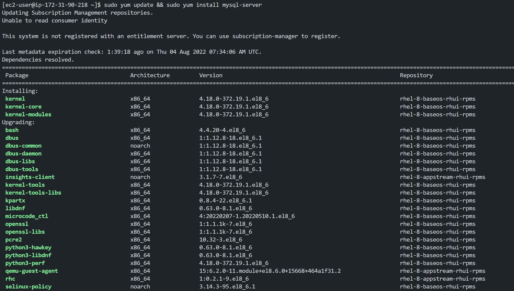

- We now need to verify that the service is up and running by using sudo systemctl status mysqld, if it is not running, restart the service and enable it so it will be running even after reboot:
    ```
    sudo systemctl restart mysqld
    sudo systemctl enable mysqld
    ```
    Results:
    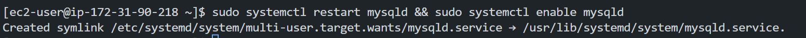

## Configuring the DB to work with WordPress
Here we need to configure the database to work with WordPress. By allowing the wordpress server be able to connect to the database, we need to configure the database to allow the wordpress server to connect to the database.
- Get the ip-address of the wordpress server
    ```
    curl http://checkip.amazonaws.com
    ```
    Results:
    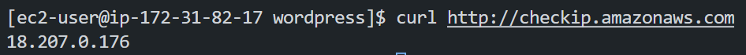
- We need to then create a user for the wordpress server to connect to the database.
    ```
    sudo mysql
    CREATE DATABASE wordpress;
    CREATE USER `myuser`@`<Web-Server-Private-IP-Address>` IDENTIFIED BY 'mypass';
    GRANT ALL ON wordpress.* TO 'myuser'@'<Web-Server-Private-IP-Address>';
    FLUSH PRIVILEGES;
    SHOW DATABASES;
    exit
    ```
    Results:
    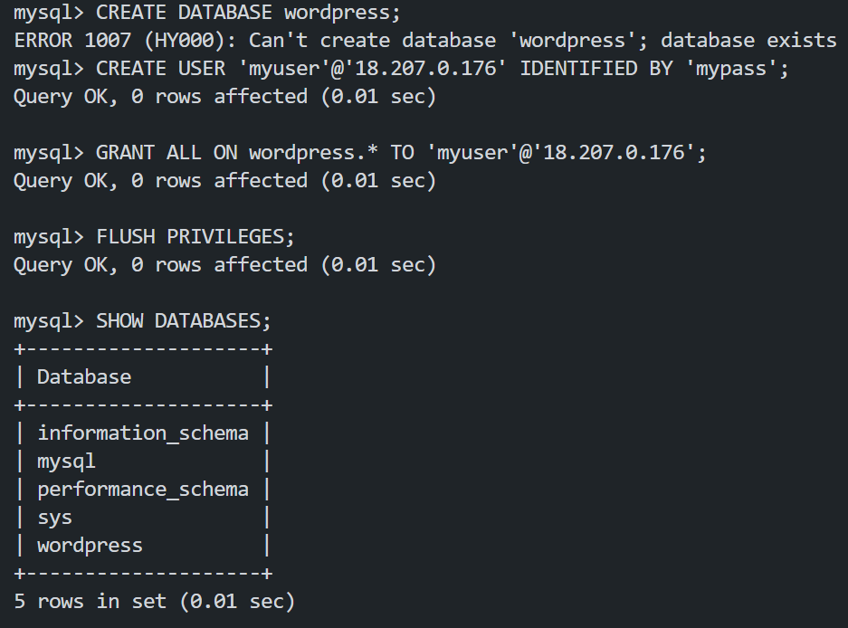


## Configure WordPress to connect to remote database.
Here we are to open MySQL port 3306 on DB Server EC2. For extra security, you shall allow access to the DB server ONLY from your Web Server’s IP address, so in the Inbound Rule configuration specify source as /32.
- Install MySQL client and test that you can connect from your Web Server to your DB server by using mysql-client
    ```
    sudo yum install mysql
    ```
    Results:
    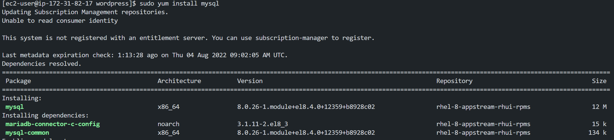
    - Create login to the database on the db server
    ```
    sudo mysql -u <user> -p -h <DB-Server-Private-IP-address>
    ```
    Note the <user> is the name of the user you created in mysql server on the db server.
    Results:
    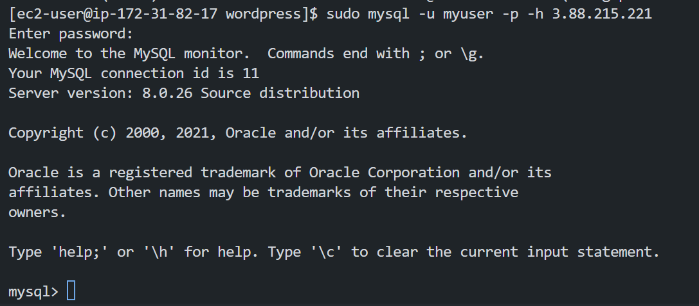

- Verify if you can successfully execute SHOW DATABASES; command and see a list of existing databases.
    ```
    SHOW DATABASES;
    ```
    Results:
    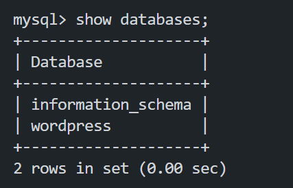

- Change permissions and configuration so Apache could use WordPress:
Here we need to create a configuration file for wordpress in order to point client requests to the wordpress directory.
    ```
    sudo nano /etc/httpd/conf.d/wordpress.conf
    ```
    and copy and paste the lines below:
    ```
    <VirtualHost *:80>
    ServerAdmin myuser@3.88.215.221
    DocumentRoot /var/www/html/wordpress

    <Directory "/var/www/html/wordpress">
    Options Indexes FollowSymLinks
    AllowOverride all
    Require all granted
    </Directory>

    ErrorLog /var/log/httpd/wordpress_error.log
    CustomLog /var/log/httpd/wordpress_access.log common
    </VirtualHost>
    ```
    Results:
    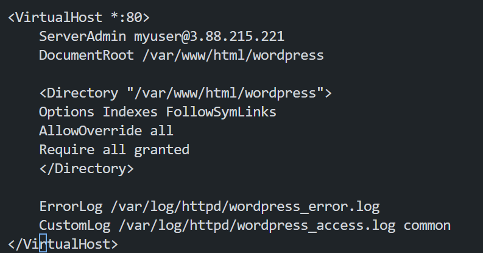

- To apply the changes, restart Apache
    ```
    sudo systemctl restart httpd
    ```
    Results:
    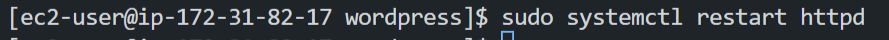

- Edit the wp-config file 
    ```
    sudo nano /var/www/html/wordpress/wp-config.php
    ```
    and add the following lines:
    ```
    define('DB_NAME', 'wordpress');
    define('DB_USER', 'myuser');
    define('DB_PASSWORD', 'mypass');
    define('DB_HOST', '<db-Server-Private-IP-Address>');
    define('DB_CHARSET', 'utf8mb4');
    define('DB_COLLATE', '');
    ```
    Results:
    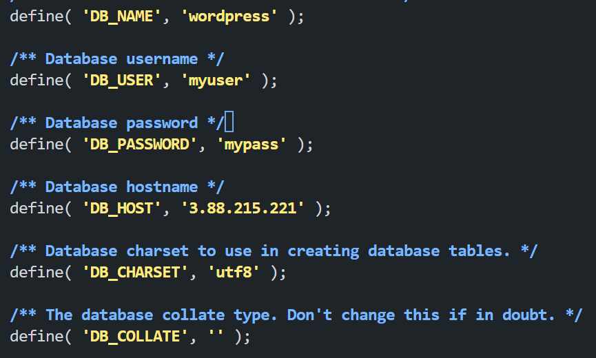

- configure SELinux for wordpress
    ```
    sudo semanage fcontext -a -t httpd_sys_rw_content_t "/var/www/html/wordpress/.*?"
    ```
    <b>Note:</b> The semanage command is not available on CentOS 7.x.x. and you might need to install it using the following command:
    ```
    sudo yum provides /usr/sbin/semanage
    sudo yum install policycoreutils-python-utils
    ```
    Results:
    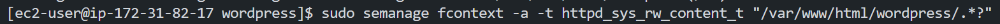

- Try to access from your browser the link to your WordPress http://<Web-Server-Public-IP-Address>/
    Results:
    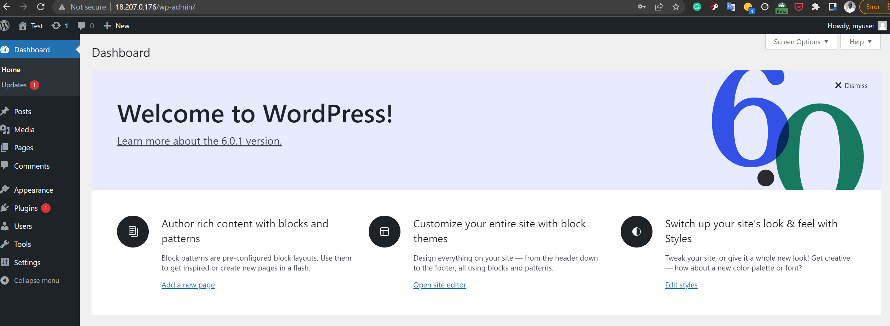